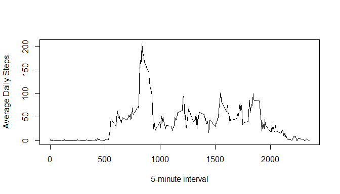

## Loading and preprocessing the data

Show any code that is needed to

1. Load the data (i.e. read.csv())


```r
data <- read.csv(unz("activity.zip", "activity.csv"), colClasses = c(date = "Date"))
```

2. Process/transform the data (if necessary) into a format suitable for your analysis

## What is mean total number of steps taken per day?

For this part of the assignment, you can ignore the missing values in the dataset.

1. Make a histogram of the total number of steps taken each day


```r
steps.per.day <- with(data, tapply(steps, date, sum, na.rm = TRUE))
hist(steps.per.day)
```

<!-- -->

```r
mean.step <- mean(steps.per.day)
median.step <- median(steps.per.day)
```

2. Calculate and report the mean and median total number of steps taken per day


```r
mean.step <- mean(steps.per.day)
median.step <- median(steps.per.day)
```

The mean steps per day is 9354.2, and the median is 10395

## What is the average daily activity pattern?

1.Make a time series plot (i.e. type = "l") of the 5-minute interval (x-axis) and the average number of steps taken, averaged across all days (y-axis)


```r
average.daily.steps <- with(data, tapply(steps, interval, mean, na.rm = TRUE))
plot((names(average.daily.steps)), average.daily.steps, type = "l")
```

<!-- -->

2. Which 5-minute interval, on average across all the days in the dataset, contains the maximum number of steps?


```r
max <- names(which.max(average.daily.steps))
```

The maximum interval is 835

## Imputing missing values


## Are there differences in activity patterns between weekdays and weekends?
